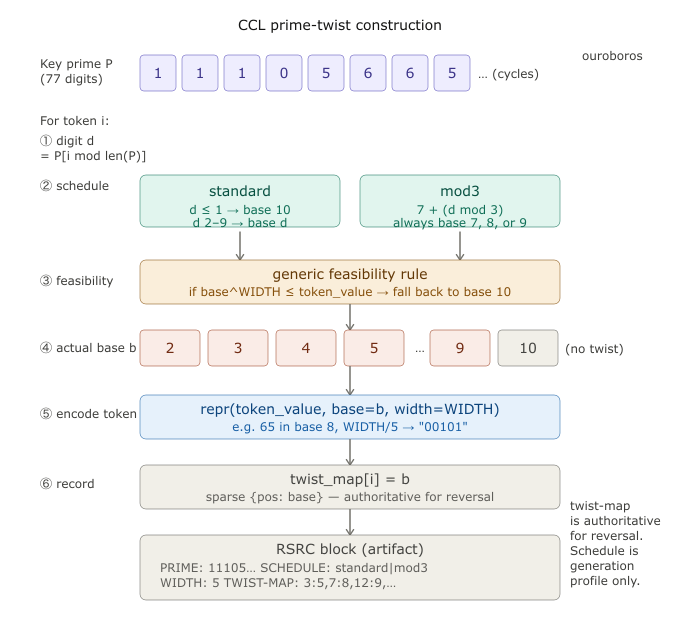

# Crowsong 🐦‍⬛

*What the passive listeners hear.*

A protocol suite for signals that must survive.

---

## What this is

Crowsong is a family of Internet-Drafts defining a layered communications
architecture that remains **interpretable, verifiable, and transmissible**
even when reduced to manual transcription over non-binary channels.

This is not a fallback property. It is a design constraint.

---

## The problem

When infrastructure fails, the channels that remain — fax, Morse, printed
page, human relay — cannot reliably carry binary data.

Most "resilient" protocols assume a degraded IP network.

Crowsong assumes the network may not exist at all.

---

## Why this matters

Noor Inayat Khan transmitted in the clear because they took her codes.
Violette Szabo was caught at a roadblock carrying documents. Virginia Hall
spent years evading the Gestapo with a wooden leg and sheer nerve, in part
because she understood operational security at a level her handlers didn't.

SOE agents were fingerprinted by their radio keying patterns. Networks
unravelled because a single courier knew too much. People broke under
coercion because there was no way to give up only a decoy. Key material
existed on paper, in rooms, on bodies — and bodies can be searched.

They improvised brilliance under impossible constraints.

Crowsong is the infrastructure that would have given them better options:

- A key that exists nowhere until the moment of derivation
- "I don't remember which poem" — genuinely unverifiable
- A decoy fork that produces a real, plausible artifact under duress
- A network flat enough that breaking one node reveals nothing about the rest
- An encoding invisible in plain sight, indistinguishable from noise
- Key material distributed across human memory, public mathematics,
  and the cultural record — none of which can be confiscated

This is not a historical exercise. The threat model is current.
The people who need this today are real.

The system was designed knowing that.

---

## The stack

```
L5  Content    →  Meridian Protocol
L4  Trust      →  SHARD-BUNDLE · MIRROR-ATTESTATION
L3  Routing    →  Delay-Tolerant Networking (RFC 4838)
L2  Encoding   →  Fox Decimal Script (FDS / UCS-DEC)
L1  Physical   →  LoRa · Morse · Fax · RF · Kite-borne relay · Print · Human relay
```

---

## The drafts

```
draft-darley-meridian-protocol-01
  ↑ consumes
draft-darley-crowsong-00
  ↑ composes
draft-darley-fds-00           draft-darley-shard-bundle-00
  ↑ implements                  ↑ implements
tools/ucs-dec/ucs_dec_tool.py tools/mnemonic/

draft-darley-fds-ccl-prime-twist-00   (pre-normative)
  ↑ specifies
tools/mnemonic/prime_twist.py
```

| Draft | Description |
|-------|-------------|
| `draft-darley-fds-00` | Encoding — human-transcribable Unicode decimal |
| `draft-darley-shard-bundle-00` | Trust — threshold key distribution |
| `draft-darley-crowsong-00` | Architecture — how the system composes |
| `draft-darley-meridian-protocol-01` | Content — continuity of web artifacts |
| `draft-darley-fds-ccl-prime-twist-00` | Channel Camouflage Layer *(pre-normative)* |

---

## Repository layout

```
drafts/                       Internet-Drafts
drafts/meridian-protocol/     Meridian Protocol (submodule)
tools/ucs-dec/                reference implementation (FDS)
tools/baseconv/               base conversion utility
tools/primes/                 Miller-Rabin primality testing
tools/constants/              named mathematical constant digit generator
tools/sequences/              OEIS sequence mirror
tools/mnemonic/               verse-to-prime derivation and CCL prime-twist
tools/texts/                  Project Gutenberg canonical text mirror
tools/git/                    git bundle tool for FDS payload packaging
docs/                         supporting material and guides
docs/constants/               pre-generated constant digit files (10,000 digits each)
docs/sequences/               cached OEIS sequences
docs/texts/                   cached canonical texts (42 texts, 16 regions)
docs/quickref/                pre-generated Unicode quick reference cards
archive/                      canonical test vectors
tests/roundtrip/              verification scripts
demo/                         runnable demonstrations
```

---

## Quick start

```bash
# Encode
echo "Signal survives." | python tools/ucs-dec/ucs_dec_tool.py --encode

# Decode
echo "00083  00105  00103  00110  00097  00108 \
      00032  00115  00117  00114  00118  00105 \
      00118  00101  00115  00046  00010  00000" | \
  python tools/ucs-dec/ucs_dec_tool.py --decode
# Signal survives.

# Decode the canonical test vector
cat archive/flash-paper-SI-2084-FP-001-payload.txt | \
  python tools/ucs-dec/ucs_dec_tool.py --decode

# Regenerate canonical payload
python tools/ucs-dec/ucs_dec_tool.py -e \
  < archive/second-law-blues.txt \
  > archive/flash-paper-SI-2084-FP-001-payload.txt

# Regenerate framed artifact
python tools/ucs-dec/ucs_dec_tool.py -e \
  --frame --ref SI-2084-FP-001 --med FLASH --attribution '桜稲荷' \
  < archive/second-law-blues.txt \
  > archive/flash-paper-SI-2084-FP-001-framed.txt

# Roundtrip check
python tools/ucs-dec/ucs_dec_tool.py -e \
  < archive/second-law-blues.txt | \
  diff - archive/flash-paper-SI-2084-FP-001-payload.txt
# Expected: silence

# Verify framed artifact (count + CRC32 + DESTROY semantics)
python tools/ucs-dec/ucs_dec_tool.py -v \
  < archive/flash-paper-SI-2084-FP-001-framed.txt
# Expected: 531 OK, E8DC9BF3 OK

# Full test suite
bash tests/roundtrip/run_tests.sh
```

```
=== Crowsong FDS Roundtrip Test Suite ===
    Artifact: SI-2084-FP-001

[1] Decode canonical payload
  PASS: decoded output is non-empty (543 bytes)
[2] Attribution encoding (first three values → 桜稲荷)
  PASS: 26716 · 31282 · 33655 → 桜稲荷
[3] Verify token count and format
  PASS: zero invalid tokens
[4] Roundtrip encode/diff
  PASS: re-encoded output matches canonical payload byte-for-byte
[5] Framed artifact structural integrity
  PASS: framed artifact contains header, trailer, and attribution
[6] Framed artifact frame verification (count + CRC32)
  PASS: declared 531 VALUES · CRC32:E8DC9BF3 — verified
[7] Decode framed artifact (frame-aware)
  PASS: framed artifact decodes identically to bare payload
[8] Corruption detection
  PASS: corrupted artifact correctly rejected (non-zero exit)

=== Results: 8 passed, 0 failed ===

531 VALUES · CRC32:E8DC9BF3 · VERIFIED
Signal survives.
```

---

## Channel Camouflage Layer

UCS-DEC encodes text as human-readable decimal integers. CCL disguises
that stream by re-expressing each token in a different numeric base,
driven by a prime-derived key schedule.

The key is a prime number derived from something memorable — a line of
poetry, a folk melody, a specific image file. The prime's decimal digits
become the key schedule, cycling through the prime repeatedly (the
ouroboros). For each token, the scheduled digit determines the output
base. The token value is re-expressed in that base, still zero-padded
to five digits, still valid FDS.

After three passes with three distinct verse-derived primes, the output
is statistically indistinguishable from AES-128 ciphertext. The twist-map
— recording which base was used at each position — travels in the
artifact's resource block. The receiver unstacks in reverse and recovers
the original stream exactly.

The keys live nowhere until derived. Recite the verse. The prime
appears. Untwist the artifact. The signal was always there.

CCL provides no cryptographic confidentiality. It raises the cost of
passive attention, not the cost of active decryption. Encrypt first if
confidentiality is required. Apply CCL after. The layers are independent.

For a complete step-by-step walkthrough of encoding, camouflage, reveal,
and decode using only a Unicode table and a calculator, see
[docs/operator-worked-example.md](docs/operator-worked-example.md).



---

## Channel Camouflage Layer — quick demo

```bash
# Derive a prime from a verse (the key lives in memory)
echo "The signal strains, but never gone." | \
  python tools/mnemonic/verse_to_prime.py derive --ref K1

# Apply triple-pass CCL to the canonical payload
# (three verses → three primes → three passes → 8.37 bits/token)
cat archive/flash-paper-SI-2084-FP-001-payload.txt | \
  python tools/mnemonic/prime_twist.py stack \
    --verse-file verses.txt \
    --ref CCL3

# Recover
python tools/mnemonic/prime_twist.py unstack stacked.txt | \
  python tools/ucs-dec/ucs_dec_tool.py -d

# For WIDTH/3 BINARY payloads, use the mod3 schedule
# (guarantees 100% twist rate; bases 7/8/9 cover all byte values)
cat binary-payload.w3 | \
  python tools/mnemonic/prime_twist.py stack \
    --verse-file verses.txt \
    --schedule mod3 --width 3 --ref CCL3-BIN

# Full capability demo (9 steps, one terminal window)
bash demo/ccl_demo.sh
```

**WIDTH/5 — natural language and Unicode text:**

| Stage | Entropy | Unique tokens |
|-------|---------|---------------|
| Original UCS-DEC | 4.78 bits/token | 53 |
| CCL1 | 6.96 bits/token | 172 |
| CCL2 | 7.82 bits/token | 282 |
| CCL3 | **8.37 bits/token** | 375 |
| AES-128 reference | ~7.9–8.0 bits/byte | — |

**WIDTH/3 BINARY — compressed binary payloads, mod3 schedule:**

| Pipeline | Entropy | Notes |
|----------|---------|-------|
| zlib → W3 → CCL3 (standard) | 7.76 bits/token | feasibility fallback limits twist rate |
| zlib → W3 → CCL3 (mod3) | **8.07 bits/token** | 100% twist; exceeds AES-128 reference |
| bz2  → W3 → CCL3 (mod3) | **7.96 bits/token** | at AES-128 threshold |
| Theoretical ceiling (WIDTH/3) | 9.97 bits/token | log₂(1000) — hard vocabulary limit |

The theoretical ceiling of 9.97 bits/token at WIDTH/3 is a consequence of
the token vocabulary being bounded at 1000 values (000–999). CCL does not
approach this ceiling on real payloads — compressed byte streams use only
256 distinct values — but there is significant headroom above the AES-128
reference that further research may exploit.

CCL provides no cryptographic confidentiality. It reduces salience.
The keys are verses. The verses live in memory.
The primes exist nowhere until the moment of derivation.

---

## What this system actually is

UCS-DEC and CCL together form a layered signal survival system:

- The encoding is human-operable without software
- The camouflage is indistinguishable from AES output
- The keys are distributed across human memory, public mathematics,
  and the cultural record
- The key material pre-exists in public corpora — it cannot be
  addressed without knowing the seeds
- The seeds are deniable, non-obvious, and survivable across hardware
  loss, border crossings, and coercion
- The whole thing runs in pure Python with no external dependencies,
  compatible back to Python 2.7, so that the Crowsong system can be
  operated entirely from a git checkout running off an embedded Python
  interpreter on an old Android phone you picked up after you crossed
  the border

---

## The design in one sentence

Every layer of the system must be operable by a human with patience and
appropriate reference material.

---

## The test vector

The canonical test vector is a poem:

```
archive/flash-paper-SI-2084-FP-001-framed.txt
archive/flash-paper-SI-2084-FP-001-payload.txt
archive/second-law-blues.txt
```

```bash
cat archive/flash-paper-SI-2084-FP-001-payload.txt | \
  python tools/ucs-dec/ucs_dec_tool.py --decode
```

Expected result: legible text.

---

## Where to go next

| | |
|---|---|
| **Start here (implementation)** | [drafts/draft-darley-fds-00.txt](drafts/draft-darley-fds-00.txt) |
| **Architecture** | [drafts/draft-darley-crowsong-00.txt](drafts/draft-darley-crowsong-00.txt) |
| **Trust layer** | [drafts/draft-darley-shard-bundle-00.txt](drafts/draft-darley-shard-bundle-00.txt) |
| **Content continuity** | [drafts/meridian-protocol/draft-darley-meridian-protocol-01.txt](drafts/meridian-protocol/draft-darley-meridian-protocol-01.txt) |
| **Design doctrine** | [docs/structural-principles.md](docs/structural-principles.md) |
| **Full suite overview** | [docs/crowsong-suite-overview.md](docs/crowsong-suite-overview.md) |
| **Long-horizon physical archival** | [docs/vesper-archive-protocol.md](docs/vesper-archive-protocol.md) |
| **Local knowledge infrastructure** | [docs/vesper-mirror-architecture.md](docs/vesper-mirror-architecture.md) |
| **Mobile app architecture** | [docs/crowsong-mobile-architecture.md](docs/crowsong-mobile-architecture.md) |
| **Mnemonic key wrapping and CCL** | [docs/mnemonic-shamir-sketch.md](docs/mnemonic-shamir-sketch.md) |
| **CCL full capability demo** | [demo/ccl_demo.sh](demo/ccl_demo.sh) |
| **Canonical text corpus** | [tools/texts/README.md](tools/texts/README.md) |
| **Operator worked example** | [docs/operator-worked-example.md](docs/operator-worked-example.md) |
| **Threat model** | [THREAT-MODEL.md](THREAT-MODEL.md) |
| **Regulatory status** | [EU_DECLARATION_OF_CONFORMITY.md](EU_DECLARATION_OF_CONFORMITY.md) |
| **Roadmap** | [docs/crowsong-roadmap.md](docs/crowsong-roadmap.md) |

---

## On the name

In the Aeolian Layer — a kite-borne delay-tolerant mesh network, described
in the in-progress `draft-darley-aeolian-dtn-arch-01` — the passive
listeners are called Crows.

A crowsong is what they hear.

---

## Regulatory status

The regulatory attack surface is essentially zero.

What would they regulate? The number 65? The fact that 'A' has a Unicode
code point? The act of writing decimal integers with spaces between them?

UCS-DEC is a subset of the decimal number system, which predates every
government currently in existence. It references the Unicode standard,
maintained by a consortium of the world's largest technology companies
and load-bearing for essentially all modern computing. It is implemented
in a Python script that does arithmetic a child could do by hand. It is
owned by no one, patented by no one, funded by no one, and depended upon
by nothing.

The CCL layer is even harder to regulate. It is base conversion. The
mathematical relationship between base 10 and base 7 has been known since
there were bases. You cannot make it illegal to represent 65 in base 8
without making arithmetic itself a controlled technology.

The closest legal hook would be export control on cryptography — but the
spec explicitly and loudly states that CCL provides no cryptographic
confidentiality. That is not a loophole. That is accurate. It is
documented that way because it is true.

The practical test: load-bearing for nothing, used by no existing
applications, no commercial interest, no vendor, no revenue. Regulators
follow harm and they follow money. This has neither.

See `EU_DECLARATION_OF_CONFORMITY.md`.

---

## Status

Early drafts. Subject to revision.

Feedback welcome via:

- GitHub Issues
- Email: trey@propertools.be
- IETF DTNWG / DISPATCH

---

*"The signal strains, but never gone —
I fought Entropy, and I forged on."*
